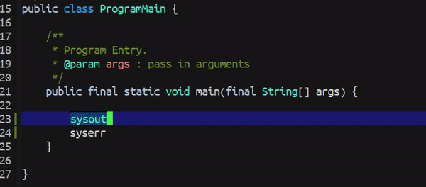

# custom-abbrev #

Customize your own abbreviation expansion in the project.<br/><br/>


## Configuration ##
Name your own customize complete config file. The default name
is `customize-complete.config`'.
```
(setq custom-abbrev-config-file "custom-abbrev.config")
```


## Key Bindings ##
Complete the current word that point currently on.
```
(define-key global-map (kbd "C-<return>") #'custom-abbrev-complete-word)
```

## Config Example ##
This is example of the `custom-abbrev.config` file. Notice this can be customize
in any language as long you follow this format.
```
#
# Customize all the expand shortcut here.
#

# Java
sysout=System.out.println();
syserr=System.err.println();
```

## Screenshot ##



## Contribution ##
If you would like to contribute to this project. You may either
clone and make pull request to this repository. Or you can
clone the project and make your own branch of this tool. Any
methods are welcome!
